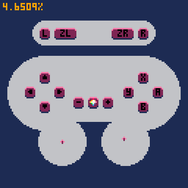

# PICO-8 Extended Controller Input Support

A proof-of-concept PICO-8 controller adapter over the GPIO `SERIAL` interface, allowing for extended controller input support including analogue sticks and more buttons.



## Building

Building the `p8-controller` process requires:
1. A C11 compiler
2. GNU `make`
3. SDL2 (make sure `sdl2-config` is correctly configured in your path)

Then, once you have all of the required dependencies, run:

```sh
make
```

## Running

### Desktop

Just run the `p8-controller` binary.
It will spawn PICO-8, passing all command line arguments it received to its PICO-8 child process, and setting up pipes to its standard input and output.
For example, you can start the demo with `make demo`.

### Web

Just make sure to load the controller JS file in your page hosting the exported PICO-8 game.

```html
<script src="p8-controller.js"></script>
```

Take a look at the `Makefile` to see how we do this automatically for the exported demo cartrige.

It may be confusing that there is a `src/controller.js` and a `target/p8-controller.js`.
This was done to allow the `Makefile` to potentially bundle multiple JavaScript files in the future.
Currently it just `cp`s the file over.

## How It Works

GPIO works very differently on varios PICO-8 targets.
Because of this, the way we support Deskop (Running PICO-8 locally on your computer) and Web (so HTML/JS exported PICO-8 games) are very different.

### Desktop

For desktop targets, additional controller data is sent over the PICO-8 process's standard input.
PICO-8 `SERIAL` command allows scheduling reading a certain amount from the process's standard input with:

```lua
serial(0x804, target_address, data_length)
```

The basic concept is to periodically send controller data over standard input for it to be read with `SERIAL` commands.
The tricky bit is synchrnozing the reading and writing of the controller data.
For this, we use the PICO-8 process's standard output.
Specifically the controller application will wait for some well-formed message indicating that the game is requesting controller data.
Once this message is received, controller state is read, encoded and sent over PICO-8's standard input.
We use `☉$CONTROLLER_INDEX☉` to request controller data.
For example, to get the controller data for controllers index 2 and 5, you could:

```lua
printh"☉2☉\n☉5☉" -- request new controller data for controllers 2 and 5 over stdout
serial(0x804,0x9a00,60) -- read 60 bytes from stdin, each controller state is 30 bytes long
```

#### Named Pipes?

Another alternative solution would have been to use named pipes and invoke PICO-8 with:

```sh
pico8 -i pipein -o pipeout
```

However, there are a couple of issues with this approach:
- Named pipe APIs aren't portable across Windows and Linux and have slightly different scemantics.
- Additional frame delay.

The additional frame delay is interesting as it appears, in part, to be a PICO-8 issue.
Specifically, PICO-8 will always wait for `SERIAL` reads before writes, even if the write was queued first.
For example:

```lua
serial(0x807, ...) -- write to file specified in `-o` parameter
serial(0x806, ...) -- read from file specificed in `-i` parameter
```

In this case, unintuitively, PICO-8 will first read from the file spcified by the `-i` parameter **before** writing to the file specified by the `-o` parameter.
Therefore, we need to request controller data one frame early.
This leads to a total of 2 frames of delay for receiving controller input:
- Frame 0: request controller data
    - `FLIP` causes the request to get flushed over the `SERIAL` interface
- Frame 1: read controller data
    - The controller data gets written to memory between frames
- Frame 2: controller data is in memory and can be used in the `_UPDATE` function

```lua
-- Frame 0
serial(0x807, ...) -- signal that we want controller data
flip() -- flush the serial output

-- Frame 1
serial(0x806, ...) -- queue read the controller data
serial(0x807, ...) -- request controller data for next frame
flip() -- flush the serial output and read serial data to memory

-- Frame 2
peek(...) -- we can now read controller data from memory
```

With the standard input and output methods, or if the `SERIAL` interfaces were flushed in the order that they were queued, then there would only be 1 frame of delay.
One possible alternative is to use named pipes, while piping standard output to one side.
This allows you to use `PRINTH` to request new controller data, which gets flushed right away.
Something like this:

```sh
pico8 -i pipein > pipeout
```

### Web

For web targets, it is very straight forward.
On each animation frame, we first set the `pico8_gpio[0]` pin to a marker value, so that the PICO-8 cart can detect that it is in web mode.
Then we read controller state and write it directly to `pico8_gpio`.
Easy-peasy-lemon-squeezy.
